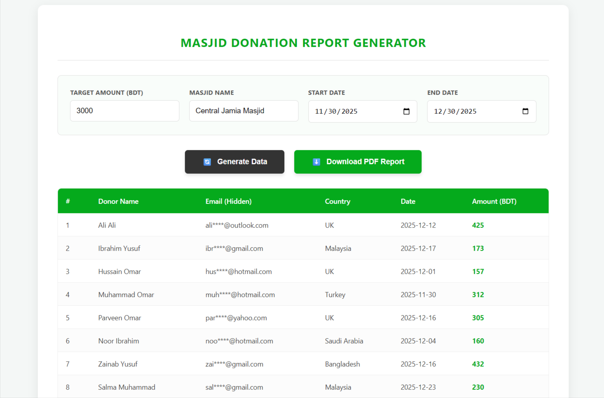

# Masjid Donation Manager



**Masjid Donation Manager** is a powerful, web-based tool designed to generate realistic donation data and export professional PDF reports for Masjids and Non-Profit Organizations. Built with modern web technologies, it features PWA capabilities, allowing users to install it as a native app on desktop and mobile devices.

---

## 🚀 Key Features

* **Dynamic Data Generation:** Automatically generates realistic donor names, masked emails, countries, and donation amounts based on a target sum.
* **Professional PDF Export:** Generates high-quality PDF reports with the organization's logo, headers, and formatted tables using `jsPDF`.
* **PWA Ready (Installable):** Can be installed as a native application on Android, iOS, and Desktop (Chrome/Edge).
* **Mobile Responsive:** Fully optimized interface for mobile, tablet, and desktop screens.
* **Secure & Fast:** Runs entirely on the client-side (browser) with no server-side data storage.
* **SEO Optimized:** Includes Open Graph tags and structured metadata for better visibility.

## 🛠 Technologies Used

* **HTML5 & CSS3:** For structure and responsive styling.
* **JavaScript (ES6+):** Core logic for data generation and DOM manipulation.
* **jsPDF & AutoTable:** For generating PDF documents.
* **Service Workers:** enabling PWA offline capabilities and installation.

## 📂 Project Structure

```bash
visernic-donation-manager/
│
├── assets/
│   ├── css/
│   │   └── style.css           # Responsive styling
│   ├── js/
│   │   └── script.js           # Logic & PDF generation
│   └── images/
│       ├── visernic-logo.svg   # Company Logo
│       ├── favicon.ico         # Browser Icon
│       ├── logo.png            # App Icon (192x192 & 512x512)
│       └── seo-banner.png      # Social Media Preview
│
├── index.html                  # Main Application
├── manifest.json               # PWA Configuration
├── sw.js                       # Service Worker
└── README.md                   # Documentation
```
## ⚙️ How to Run

Since this project uses PWA features and loads external assets (SVG/PDF libraries), it requires a local server to function correctly.

1.  **Clone the repository:**
    ```bash
    git clone [https://github.com/md-mostafa-niloy/masjid-donation-generator.git](https://github.com/md-mostafa-niloy/masjid-donation-generator.git)
    ```

2.  **Open in VS Code.**

3.  **Run with Live Server:**
    * Install the "Live Server" extension in VS Code.
    * Right-click on `index.html` and select **"Open with Live Server"**.

4.  **Install the App:**
    * Click the "Install" icon in the browser address bar (Desktop).
    * Or select "Add to Home Screen" from the browser menu (Mobile).

## 👨‍💻 Author & Credits

* **Developed by:** [Visernic Limited](https://visernic.com)
* **Lead Developer:** Md. Mostafa Niloy
* **Website:** [visernic.com](https://visernic.com)

## 📄 License

Copyright © 2025 **Visernic Limited**. All Rights Reserved.
